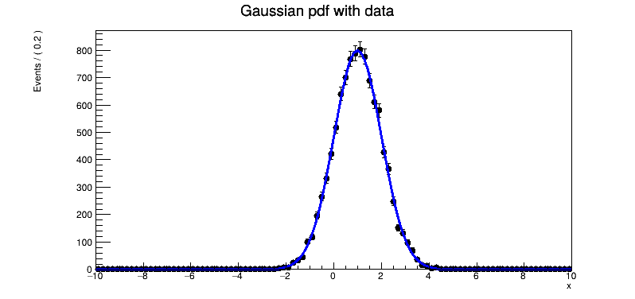
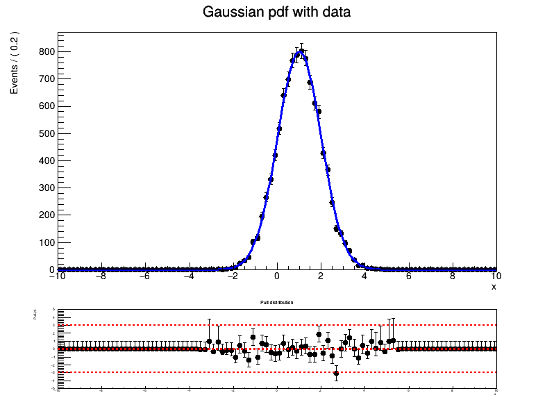

# roofit_functional
roofit-functional is a python wrapper for [RooFit framework](https://root.cern/manual/roofit/) which models the expected distribution of events in data analysis. 


# Description
RooFit implements classes that represents variables, probability density functions (PDFs) and operators to compose higher level functions. 
All classes are instrumented to be fully functional: fitting, plotting and toy event generation works the same way for every PDF regardless of its complexity. 
Some important parts of the underlying functionality are delegated to standard ROOT library. 

Here is an example of a model defined in RooFit python interface which allows the creation of bindings between Python and C++ in automatic way.

```
import ROOT
 
# Set up model
# ---------------------
# Declare variables x,mean,sigma with associated name, title, initial
# value and allowed range
x = ROOT.RooRealVar("x", "x", -10, 10)
mean = ROOT.RooRealVar("mean", "mean of gaussian", 1, -10, 10)
sigma = ROOT.RooRealVar("sigma", "width of gaussian", 1, 0.1, 10)
 
# Build gaussian pdf in terms of x,mean and sigma
gauss = ROOT.RooGaussian("gauss", "gaussian PDF", x, mean, sigma)
 
# Generate events
data = gauss.generate({x}, 10000)  # ROOT.RooDataSet
 
# Make a plot frame in x and draw both the
# data and the pdf in the frame
xframe = x.frame(Title="Gaussian pdf with data")  # RooPlot
data.plotOn(xframe)
gauss.plotOn(xframe)

# Fit pdf to data
gauss.fitTo(data, PrintLevel=-1)
 
# Draw all frames on a canvas
c = ROOT.TCanvas("basics", "basics", 800, 400)
ROOT.gPad.SetLeftMargin(0.15)
xframe.GetYaxis().SetTitleOffset(1.6)
xframe.Draw()

# Save plot into the file
c.SaveAs("basics.png")
```



This python interface requires multiline code to create variables, model parameters, PDF and make some actions, such as toy
data generation, fitting and plotting. 
roofit-functional allows to significantly shorten the code which makes similar actions but has flexible structure. 

Let us rewrite the code shown above in roofit-functional manner. 

```
import roofit_functional as rff

gauss = rff.RooFitFunction('Gauss', {'x' : [-10,10]}, 'Gaussian', {'mean' : [1,-10,10], 'sigma' : [1,0.1,10]})
data = rff.RooFitData("data","unbinned",(gauss,10000),gauss.get_x())
r = rff.RooFitMaker(data,gauss,"NLL")
p = rff.RooFitPlot(data,gauss,"x","Gaussian pdf with data")
p.make_plot()
```

We could easily create the pull plot in addition to the basic plot in one-line code: `p.make_pullplot()`




All PDFs are constructed on the basis of step-to-step procedure in the RooFit framework. 
The first step is associated with elementary PDFs, which are hard-coded. 

The full list of available elementary PDFs is as follows (to be updated):

- CrystalBall
  
- Uniform
  
- BifurGauss
  
- BreitWigner
  
- Gaussian
  
- Voigtian
  
- Novosibirsk
  
- Johnson

The possibility to include any custom PDF is put in TODO list. 

Structure of the elementary PDFs could be sequentially complicated via four base actions: summation, multiplication, convolution and composition. 
Besides PDF function, an ordinary function (not normalized in the range of its arguments) is also supported. 

Let us consider actions for PDF functions in a more detail:

1. Summation of two or more PDF functions. `sum_of_pdfs = pdf1.get_add(pdf2,{'frac': [0.5,0.,1.]})`
   Fraction of the pdf2 to the pdf1 is important to achieve the unity normalization of the sum_of_pdfs

2. 

4. 


